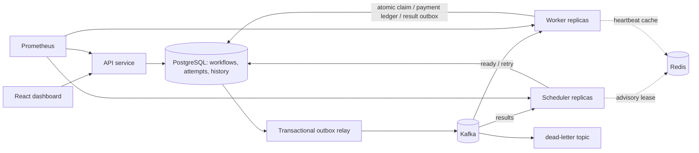
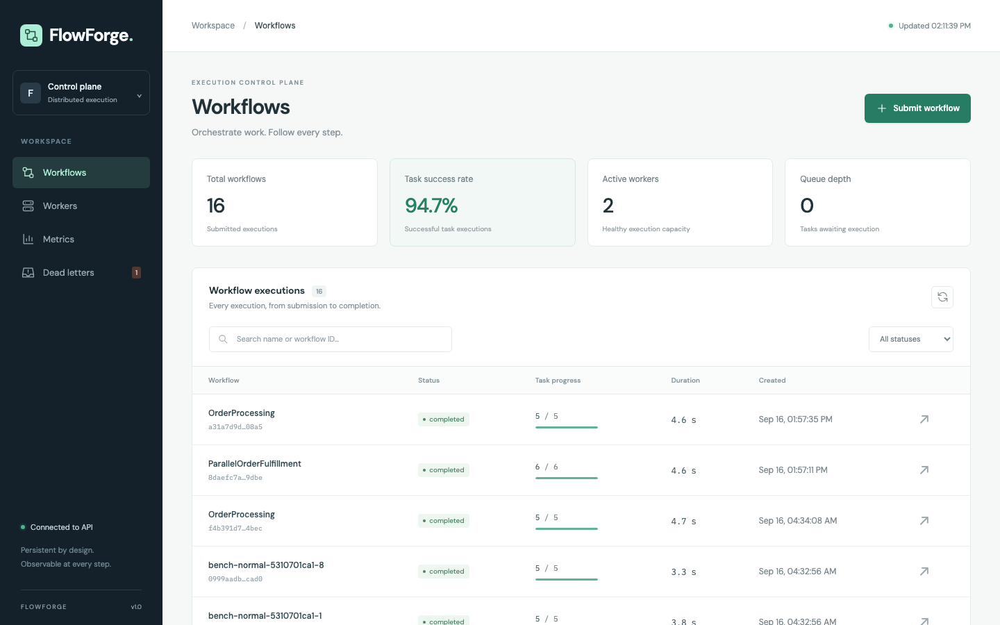
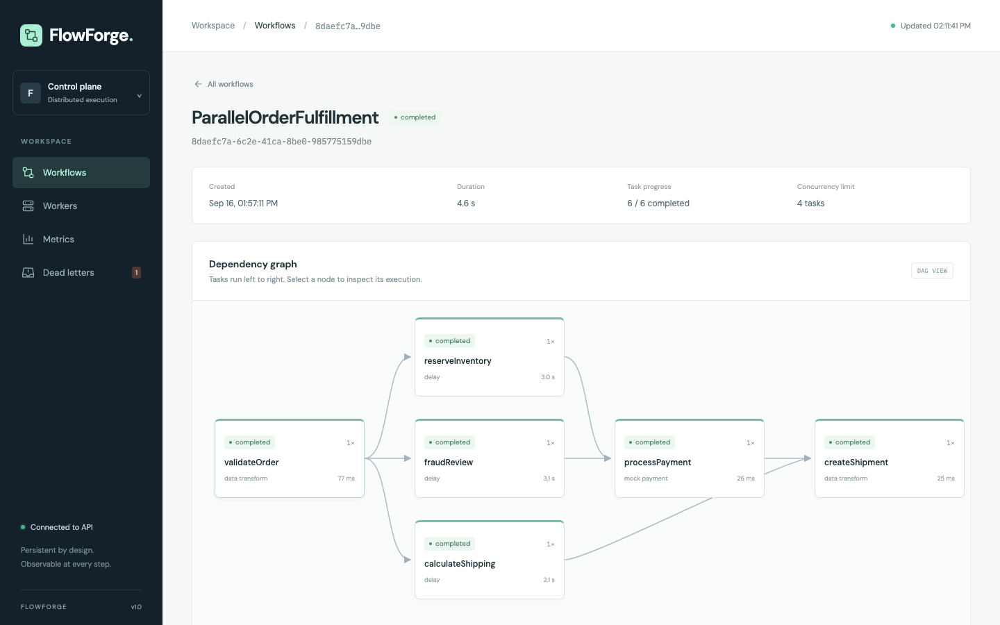
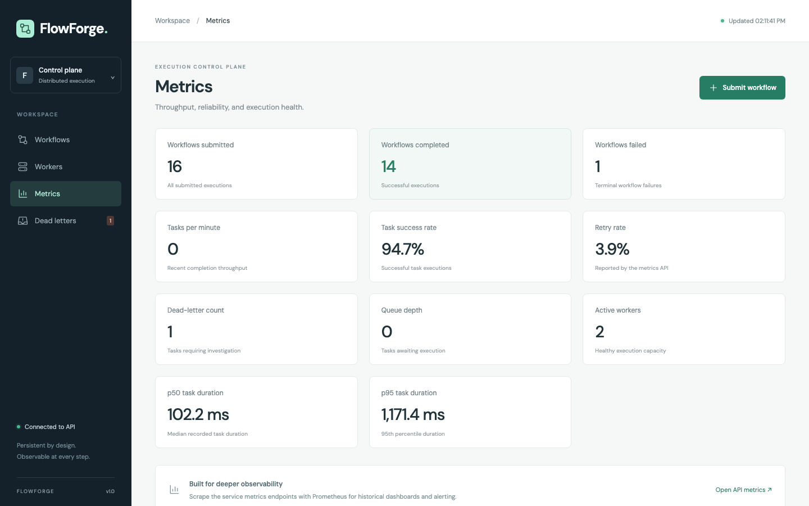
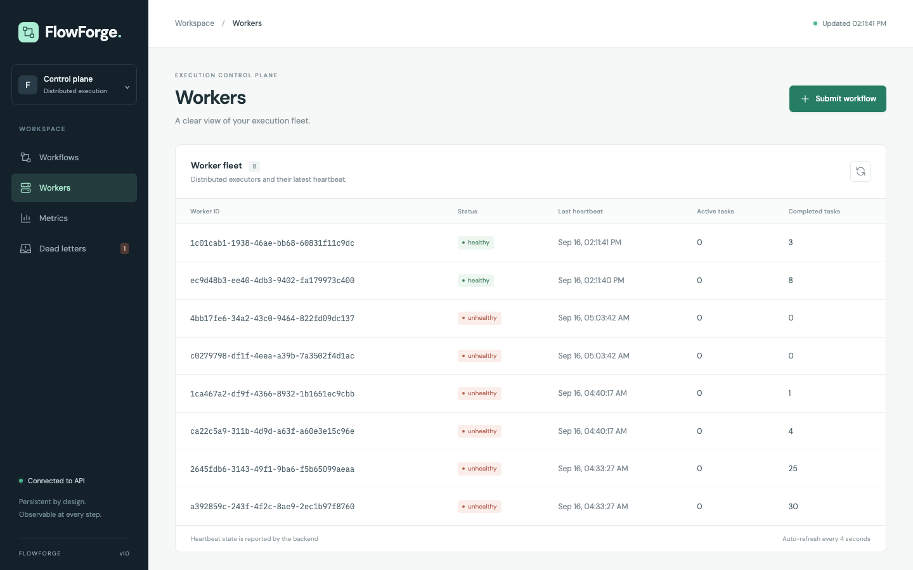

# FlowForge

**A durable DAG workflow engine built with Java 21, Spring Boot, PostgreSQL, Kafka, Redis, and React.**

FlowForge turns a workflow definition into dependency-aware, concurrent execution across independent worker processes. It is an executable distributed-systems project: the database owns state, Kafka carries dispatch and results, workers can disappear, and retries preserve an auditable attempt history.

The implementation concentrates on the difficult boundaries: a database commit versus a broker publish, a worker crash after a side effect, cancellation racing a result, and multiple schedulers admitting work simultaneously.

## Run it

Prerequisites: Docker with Compose v2 and sufficient memory for Kafka, PostgreSQL, and four JVMs (8 GiB or more allocated to Docker is recommended).

```bash
docker compose up --build -d
```

- Dashboard: <http://localhost:3000>
- API: <http://localhost:8088/api/workflows>
- Readiness: <http://localhost:8088/actuator/health/readiness>
- Prometheus metrics: <http://localhost:8088/actuator/prometheus>

The default stack starts **two worker replicas**. Host ports bind to localhost; infrastructure data lives in named volumes. `.env.example` documents configurable ports and limits. The Compose password is a local development credential.

```bash
curl -sS http://localhost:8088/api/workflows \
  -H 'Content-Type: application/json' \
  --data-binary @docs/examples/order-processing.json

curl -sS http://localhost:8088/api/workflows \
  -H 'Content-Type: application/json' \
  --data-binary @docs/examples/parallel-dag.json

docker compose up -d --scale worker=4
docker compose --profile observability up -d prometheus
docker compose logs -f scheduler worker
docker compose down  # retains execution state in volumes
```

The order example deliberately fails its first payment attempt and then succeeds after a one-second minimum backoff. Inventory, shipment, and confirmation are simulated by the built-in handlers; no external charge, shipment, or email is sent.

## Architecture



| Module | Responsibility |
|---|---|
| `api-service` | Submission, validation, cancellation, status, history, worker/DLQ views, metrics |
| `scheduler-service` | Dependency evaluation, durable concurrency admission, due retries, deadline and heartbeat recovery, result consumption |
| `worker-service` | Kafka consumers, fenced claims, bounded execution, handlers, heartbeats, result persistence |
| `shared` | Domain/event models, transactional state repository, Flyway migrations, outbox relay, coordination, metrics |
| `frontend` | Live workflow list, DAG, task details, execution history, worker fleet, metrics, dead letters |
| `load-tests` | Standard-library Python load generation, failure injection, and restart/Redis-degradation verification |
| `docker`, `k8s`, `infra` | Local containers, Kubernetes manifests, AWS deployment configuration |

Services are independently runnable and scalable, with deliberately shared database persistence code. This is a compact engine with clear runtime roles, not a claim of independent database ownership per service.

### Request and execution flow

1. The API rejects cycles, unknown/duplicate dependencies, duplicate task names, unsupported handlers, invalid timeouts/retries, and oversized payloads. Kahn's algorithm validates graphs in O(V + E).
2. One transaction writes the workflow, tasks, dependency edges, and submission event.
3. The scheduler identifies due tasks whose **every parent is COMPLETED**. It reserves global, workflow, and optional task-type capacity before generating a fresh execution UUID and READY attempt.
4. The task transition, execution event, and Kafka dispatch outbox entry commit together.
5. A relay publishes the outbox entry and waits for Kafka acknowledgement before marking it published. A crash in between may publish the same record again.
6. A worker locks the workflow and task, verifies the current execution ID and READY state, durably claims the attempt, and then acknowledges the Kafka offset. Handler execution occurs after that durable claim.
7. The worker atomically stores its result and a result outbox entry. The scheduler consumes the Kafka result notification and applies the persisted canonical result under the same locks.
8. Successful results unlock downstream tasks. All tasks completed ends the workflow. A permanent failure fails the workflow and cancels unfinished siblings/descendants.

The database does not independently drain result records: **Kafka result consumption is required to advance execution**. During a Kafka outage, committed results wait safely in the outbox.

### Idempotency and execution fencing

- A task UUID identifies the logical operation. Each attempt gets a new execution UUID, with a unique `(task_id, attempt_number)` database constraint.
- Only the current READY attempt can be claimed. Duplicate broker messages cannot obtain a second claim; broker-provided task payloads are replaced with authoritative database values.
- Results must match workflow, task, worker, and current execution ID. Cancelled, completed, and superseded attempts reject late results.
- `MOCK_PAYMENT` commits under the workflow/task lock to a ledger with **task_id as its primary key**. A worker can commit a payment and crash before reporting success; the replacement attempt returns the same payment record. Both the ledger write and the fencing check occur in one PostgreSQL transaction.
- DELAY and DATA_TRANSFORM have no external side effects. Exactly-once arbitrary network effects are **not** promised. A future payment/HTTP adapter must send the stable task UUID as a downstream idempotency key and rely on that downstream system's durable deduplication.

This is at-least-once messaging with fenced transitions and idempotent supported effects. Kafka producer idempotence alone cannot make an external side effect exactly once. See [Spring's outbox explanation](https://spring.io/blog/2023/10/24/a-use-case-for-transactions-adapting-to-transactional-outbox-pattern/) and [Kafka's delivery semantics](https://kafka.apache.org/20/design/design/).

### Scheduling and concurrency

Workflow row locks serialize lifecycle mutations; task locks follow workflow locks. Scheduler admission additionally uses a PostgreSQL transaction-scoped advisory lock, so the global limit remains correct across scheduler replicas and Redis loss. The optional Redis lease suppresses redundant scheduler scans; PostgreSQL remains the final fence.

READY and RUNNING tasks both occupy admission slots. Reserving capacity at dispatch avoids an unlimited broker backlog that exceeds the configured workflow/global limit. A worker's separate bounded executor/semaphore limits its local concurrency. Kafka partitions bound useful consumer parallelism.

| Setting | Default | Meaning |
|---|---:|---|
| `FLOWFORGE_GLOBAL_CONCURRENCY` | 32 | Maximum globally admitted READY + RUNNING tasks |
| Submission `concurrencyLimit` | 8 | Admitted tasks in one workflow |
| `FLOWFORGE_WORKER_CONCURRENCY` | 4 | Concurrent consumers/handlers per worker process |
| `FLOWFORGE_TASK_TYPE_CONCURRENCY` | empty | Optional comma-separated caps, e.g. `MOCK_PAYMENT:4,DELAY:16` |
| `WORKER_TIMEOUT_MS` | 15000 | Heartbeat expiry threshold |
| `KAFKA_TOPIC_PARTITIONS` | 12 | Partitions per application topic |
| `KAFKA_TOPIC_REPLICAS` | 1 | Local replication factor; use a resilient factor for managed Kafka |

The scheduler defaults to a 500 ms scan interval. Scheduling is bounded and favors older workflows: each tick admits from at most 200 candidate workflows, ordered by creation time. Task types already at their configured cap are excluded from candidate selection for that tick, so workflows whose only due work is type-blocked cannot fill the batch and starve a younger workflow whose work is admissible. The global database lock makes correctness easy to inspect but limits scheduler throughput; partitioned admission is a future scaling improvement.

### Retry, timeouts, and worker loss

`maxRetries` counts executions **after** the initial attempt. With three retries, a task can execute four times. The backoff is `min(1 hour, initialRetryDelayMs × backoffMultiplier^(failedAttemptNumber − 1))`; 1000 ms and multiplier 2 produce 1 s, 2 s, 4 s, 8 s minimum delays. Retry eligibility is persisted in PostgreSQL, not kept in a process timer or achieved by sleeping a Kafka consumer. Due retries get a new execution ID and go to the retry topic.

Malformed handler inputs are non-retryable. Simulated temporary payment failures, execution timeouts, and worker loss are retryable until the budget is exhausted. Exhaustion writes the final FAILED/TIMED_OUT attempt, a dead-letter record, a Kafka dead-letter outbox message, and history atomically.

Workers heartbeat every two seconds with ID, active task count, and health; successful attempts increment a durable completion count. The scheduler identifies stale workers and recovers their unfinished attempts. Execution deadlines are checked separately, so a failed result write is recoverable even if the worker continues heartbeating. Once a result is durably reported, it is not timed out merely because Kafka delivery is delayed.

Workers enforce timeouts and poll for cancellation every 250 ms. Cancellation commits immediately, fences running attempts, stops future admission, and records events. It does not undo a side effect committed before cancellation. Interrupts are cooperative; the included handlers honor them. Do not add untrusted or non-cooperative code without process isolation.

### Kafka contracts

| Topic | Producer → consumer | Purpose |
|---|---|---|
| `flowforge.tasks.ready` | Outbox relay → `flowforge-workers` | Initial admitted attempts |
| `flowforge.tasks.retry` | Outbox relay → `flowforge-workers` | Due replacement attempts |
| `flowforge.tasks.results` | Outbox relay → `flowforge-scheduler-results` | Canonical persisted-result notifications |
| `flowforge.tasks.dead-letter` | Outbox relay → external operators | Exhausted/permanent failures |

All are explicit topics. Dispatch records use execution ID as key and include workflow/task/execution IDs, attempt number, type, payload, timeout, retry policy, and creation time. Result records include worker ID, status, retryability, output/error, and completion time. Java records `TaskJob` and `TaskResult` are the version-one schemas; breaking schema evolution would require versioning.

The outbox uses `FOR UPDATE SKIP LOCKED`, letting relays on multiple services publish concurrently. A successful Kafka ACK followed by a transaction rollback causes replay, which consumers tolerate. Infrastructure failures retry without committing past a failed record. Malformed records in these internal topics require operator correction; Kafka ACLs should restrict producers. Published outbox records are retained for inspection.

### Persistence and Redis

Flyway migrates PostgreSQL on startup. UUIDs identify workflows, tasks, attempts, workers, events, and dead letters.

| Table | Stored facts |
|---|---|
| `workflows` | Name, state, concurrency limit, creation/start/finish times |
| `workflow_tasks` | Handler input/output, task state, policy, current execution/worker, retry due time |
| `task_dependencies` | Parent edges with same-workflow foreign-key constraints |
| `task_attempts` | Every execution, worker, deadline, result receipt, terminal state and error |
| `workers` | Heartbeat, health, active and completed task counts |
| `workflow_events` | Ordered durable lifecycle events with identifiers and details |
| `outbox` | Unpublished/published dispatch, result, retry, and dead-letter messages |
| `dead_letters` | Queryable final failure records, unique per execution |
| `payment_ledger` | One demonstrable payment side effect per logical task |

Indexes cover workflow status, workflow tasks, due/READY tasks, RUNNING workers, current execution IDs, attempt deadlines, heartbeat checks, and workflow history. Redis holds expiring scheduler leases and worker status caches. Losing all Redis data does not lose workflow state or weaken concurrency enforcement.

## API

| Method | Endpoint | Response |
|---|---|---|
| POST | `/api/workflows` | 201, workflow and Location header |
| GET | `/api/workflows?limit=100&offset=0` | Most recent workflows |
| GET | `/api/workflows/{id}` | Workflow state and completion counts |
| POST | `/api/workflows/{id}/cancel` | Idempotent cancellation; terminal workflows retain their state |
| GET | `/api/workflows/{id}/tasks` | Task states, input/output, dependency IDs |
| GET | `/api/workflows/{id}/attempts` | Per-attempt deadlines, times, errors, and results |
| GET | `/api/workflows/{id}/history?limit=1000&offset=0` | Ordered events |
| GET | `/api/workers` | Worker health, heartbeat, active/completed counts |
| GET | `/api/dead-letters?limit=100&offset=0` | Final failures |
| GET | `/api/admin/payments?workflowId={id}` | Read-only mock ledger, used by verification |
| GET | `/api/metrics/summary` | Durable execution metrics |

Errors use Spring Problem Details: invalid requests are 400 and unknown workflows are 404. Lists are paginated with a maximum limit of 5000. Task and attempt lists are bounded by the 1000-task and 20-retry submission limits.

Minimal parallel workflow:

```json
{
  "name": "ParallelExample",
  "concurrencyLimit": 2,
  "tasks": [
    {"name": "left", "taskType": "DELAY", "payload": {"durationMs": 1000}},
    {"name": "right", "taskType": "DELAY", "payload": {"durationMs": 1000}},
    {"name": "join", "taskType": "DATA_TRANSFORM", "dependsOn": ["left", "right"],
     "payload": {"operation": "UPPERCASE", "data": "complete"}}
  ]
}
```

Supported handlers: `DELAY` (bounded duration), `DATA_TRANSFORM` (IDENTITY, UPPERCASE, LOWERCASE), and `MOCK_PAYMENT` (positive amount, three-letter currency, optional orderId/failUntilAttempt). Tasks receive their submitted payload; parent outputs are available through the API but are not automatically interpolated into downstream inputs. HTTP, webhook, arbitrary file access, and arbitrary user code are intentionally outside this implementation.

## Dashboard

The React dashboard polls the API every four seconds, keeps the last successful snapshot when a
request fails, and pauses polling in background tabs. Screenshots below are captured from the
running Compose stack at `http://localhost:3000`.

| | |
|---|---|
|  |  |
| Workflow list: status, task progress, duration, creation time, search and status filter | Workflow detail: layered DAG with per-node status, attempt count, type, and duration |
|  |  |
| Metrics: submitted/completed/failed, tasks per minute, success and retry rate, dead letters, queue depth, active workers, p50/p95 | Worker fleet: per-worker status, last heartbeat, active and completed task counts |

Also captured: [task inspector](docs/screenshots/03-task-inspector.png),
[dead letters](docs/screenshots/06-dead-letters.png),
[submission dialog](docs/screenshots/07-submit-dialog.png),
[API-unavailable state](docs/screenshots/08-api-unavailable.png), and mobile layouts for
[workflows](docs/screenshots/09-mobile-workflows.png) and [metrics](docs/screenshots/10-mobile-metrics.png).

The dashboard is a monitoring surface, not an administrative one: it can submit and cancel
workflows, but there is no authentication, no dead-letter replay, and no editing of running
executions. Fonts are loaded from Google Fonts, so text falls back to system faces when the browser
has no outbound network access.

## Local development and tests

Java 21, Maven 3.9+, Node 20.19+/22+, and Docker are sufficient.

```bash
mvn verify                         # JUnit + Mockito + real Testcontainers PostgreSQL/Kafka
cd frontend && npm ci && npm run build
```

To run a JVM directly, start infrastructure with `docker compose up -d postgres redis kafka`, run `mvn -DskipTests package`, then use `java -jar api-service/target/api-service-0.1.0-SNAPSHOT.jar`. The API defaults to port 8080 when run directly; set `PORT=8088` if needed. Scheduler and worker default to 8081/8082. Run each in a separate terminal and set a distinct PORT for additional local workers. The Vite dev server proxies `/api` and `/actuator` to `http://localhost:8080` by default; run `VITE_API_PROXY=http://localhost:8088 npm run dev` from `frontend` to target the Compose API instead.

`mvn verify` runs 60 tests: 28 in `shared` (including 19 Testcontainers integration cases against real PostgreSQL and Kafka), 6 in `api-service`, 6 in `scheduler-service`, and 20 in `worker-service`.

Tests cover cycles/disconnected graphs, dependency joins, global/workflow/type limits, admission fairness past the candidate batch, competing schedulers/claims, duplicate payment effects, stale-result fencing, heartbeat loss, independent deadlines, persisted results during broker delay, cancellation, retry exhaustion, database constraints/rollback, Kafka outbox replay, API validation, and worker handler/acknowledgement behavior. Docker is required for integration tests; they are not silently replaced by mocks.

## Observability and benchmarks

JSON logs carry workflowId, taskId, executionId, workerId, and lifecycle event fields. `/actuator/prometheus` exposes JVM/process/HTTP metrics, durable engine gauges, worker result counters, and worker duration histograms. Engine snapshots refresh every 10 seconds.

Summary semantics: success rate is completed attempts / completed+failed+timed-out attempts; retry rate is attempts numbered >1 / all attempts; tasks/minute is completions in the last 60 seconds; queue depth is **durable READY task count**, not raw Kafka offset lag; p50/p95 durations measure completed attempts from claim through scheduler application. Global summaries are the same on each service, so do not sum those gauges across replicas. Worker histograms are per-process and can be aggregated normally.

See [benchmark-results.md](benchmark-results.md) for measured results and [benchmark methodology](docs/benchmark-methodology.md) for reproducible commands and definitions. Raw JSON artifacts include workflow IDs, execution attempts, dependency checks, observed retry delays, and payment-ledger counts. No values are estimated as if they were test results.

```bash
python3 load-tests/benchmark.py --scenario normal --workflows 1000 --output load-tests/results/normal.json
python3 load-tests/benchmark.py --scenario high-concurrency --workflows 100 --width 20 --output load-tests/results/concurrency.json
python3 load-tests/benchmark.py --scenario large-dag --workflows 2 --width 20 --layers 20 --output load-tests/results/large-dag.json
python3 load-tests/benchmark.py --scenario retry-storm --workflows 100 --width 10 --output load-tests/results/retry-storm.json
python3 load-tests/chaos.py --scenario all --allow-worker-kill --output load-tests/results/chaos.json
python3 load-tests/resilience.py --scenario all --allow-service-restart --output load-tests/results/resilience.json
```

The chaos command sends SIGKILL only to an identified FlowForge worker, restarts it in a `finally` block, publishes duplicate records through the real broker, and verifies ledger/history state. It also checks cycles, parallel overlap, timeout exhaustion, and cancellation.

The resilience command restarts the API and scheduler while a dependency chain is mid-execution and verifies the workflow still completes with its pre-restart history intact, then stops Redis and requires a workflow submitted during the outage to complete on PostgreSQL fencing alone. Both scenarios label-verify every container they touch against this Compose project and restore it in a `finally` block.

## Kubernetes and AWS

See [deployment guide](docs/deployment.md). Kubernetes includes API, scheduler, worker, frontend, PostgreSQL, Redis, Kafka, health probes, resource budgets, secret references, and worker autoscaling. The local stateful stack is for development. The AWS overlay is structured for EKS with RDS PostgreSQL, ElastiCache, MSK, and ECR images; it requires actual endpoints, secrets, TLS/network policies, and account infrastructure. Kubernetes/AWS deployment is not claimed unless explicitly recorded in the verification report.

## Verification status

Recorded in [benchmark-results.md](benchmark-results.md), with raw JSON in `load-tests/results/`.

**Verified by execution on this machine (Apple M3 Pro, Docker 11 CPUs / 7.65 GiB, 2 worker replicas):**

- `mvn verify` on Temurin 21 — 60 tests, 0 failures, 0 errors, 0 skipped, including 19 Testcontainers cases on real PostgreSQL and Kafka.
- `docker compose up --build -d` — all 8 containers healthy; both Flyway migrations applied; 10 tables present; all four Kafka topics created with 12 partitions.
- Frontend built (`tsc -b && vite build`, no errors) and served through its own nginx image; all dashboard views driven in headless Chromium with zero console errors, zero page errors, and no page-level horizontal overflow from 360 px to 1440 px.
- Benchmarks, all `verified: true`: `normal` 1000 workflows / 5000 tasks, `high-concurrency` 100 × 20, `large-dag` 2 × 20 × 20 (15 200 dependency edges checked), `retry-storm` 100 × 10 (2000 backoff intervals checked). Zero duplicate payment side effects in every run.
- Chaos, `verified: true`: cycle rejection, real parallel overlap, timeout exhaustion into the dead-letter path, cancellation blocking a downstream payment, 10 duplicate Kafka records with a replayed execution ID producing no extra attempt or ledger row, and a SIGKILLed worker recovered by heartbeat expiry with the workflow completing.
- Resilience, `verified: true`: API and scheduler restarted mid-execution with history intact and the workflow completing; a workflow submitted while Redis was stopped completing on PostgreSQL fencing alone.

**Not verified:**

- **Kubernetes and AWS were never deployed.** Both overlays render with `kubectl kustomize` and all seven workloads carry startup/readiness/liveness probes with resource requests and limits, but no cluster was available here, so nothing was applied or scheduled. AWS endpoints, credentials, certificates, and image locations are placeholders.
- Single runs only; no variance or soak measurement, and an unrelated Docker project shared the host.
- Benchmark client-clock durations disagree with database wall-clock spans. Correctness checks passed, but the recorded throughput is not a validated capacity measurement; see the timing limitation in [benchmark-results.md](benchmark-results.md).
- No Kafka outage, PostgreSQL failover, network partition, paused-worker, or multi-region recovery experiment.

## Scope and tradeoffs

- **An inspectable engine, not a hosted production service.** No authentication/tenant isolation, public ingress, TLS termination, request throttling, or PII filtering is included. Keep local bindings/private networking and add those controls before exposing it.
- A shared PostgreSQL schema and global admission lock favor consistency and clarity over maximum throughput. Recovery/scheduling remains O(active work); very large deployments need partitioned ownership, fairness policies, and retention.
- Retry delays are deterministic and capped; configurable jitter and per-tenant retry budgets are future work. The implementation avoids immediate retry storms but cannot eliminate synchronized retries to a real downstream service.
- Local Kafka/PostgreSQL/Redis each have one replica. This is a development topology, not highly available infrastructure. Production deployment needs managed replication, backups, monitoring, and disaster-recovery exercises.
- Built-in effects are safe and bounded; third-party exactly-once guarantees require downstream cooperation. Workflow cancellation is not transactional compensation.
- There is no workflow versioning, branching predicates, cron triggers, human approval, compensation/saga language, result interpolation, or DLQ replay endpoint. Dead letters are observable and retained.
- Completed attempts/events/outbox entries have no automatic retention policy. Add archival/partitioning before sustained production ingestion.

Next improvements: tenant-scoped admission, versioned schemas, jitter/budgets, cursor pagination, external OIDC authorization, managed-service integration tests, asynchronous outbox batching/CDC, per-handler downstream idempotency contracts, and richer workflow data flow.
